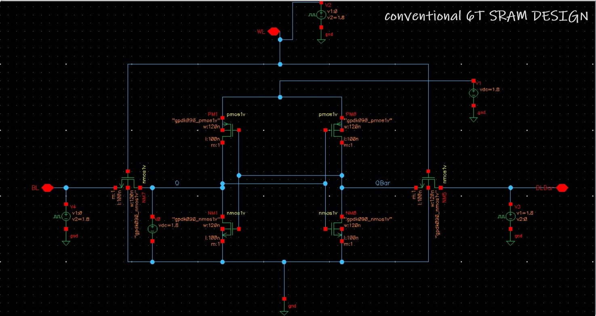
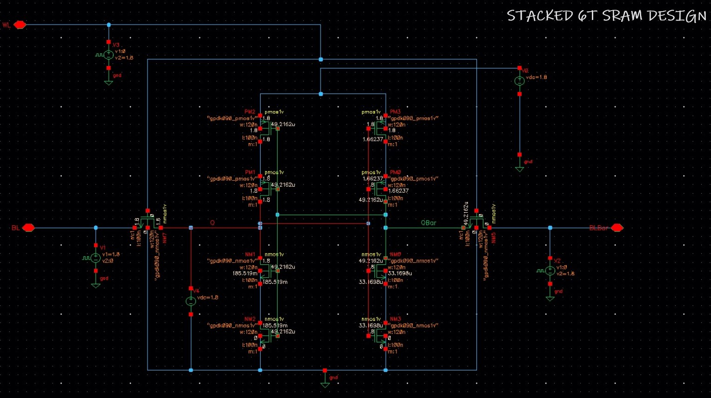
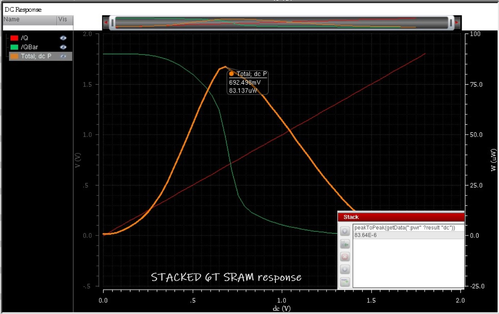
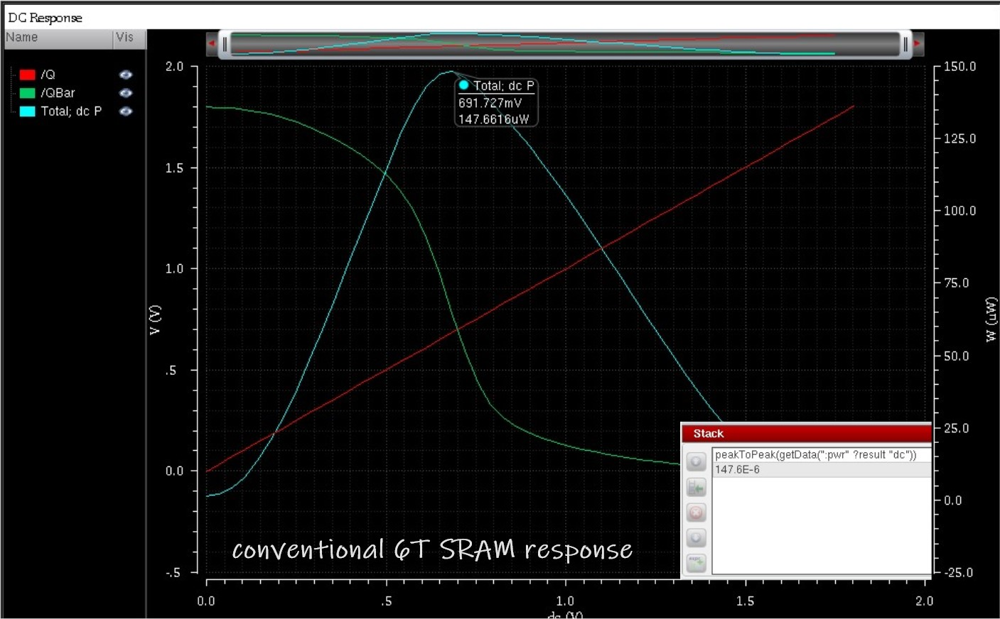
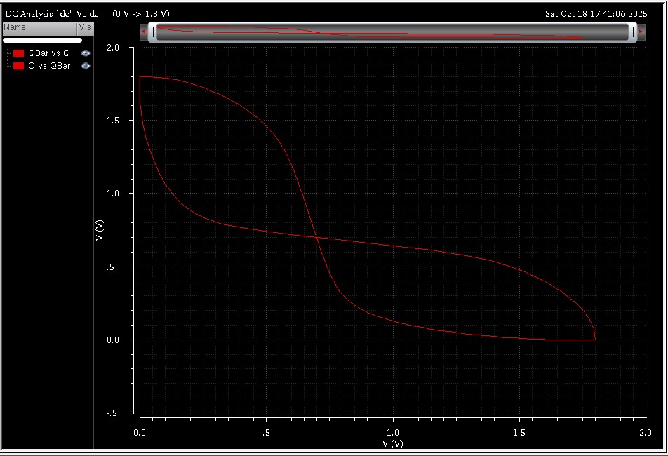

# Low-Power 6T SRAM Design: Conventional vs Stacked

**Author:** Aditya Dwivedi  

---

## Table of Contents

- [Project Description](#project-description)  
- [Motivation](#motivation)  
- [Architecture Overview](#architecture-overview)  
- [Simulation Setup](#simulation-setup)  
- [Results & Analysis](#results--analysis)  
- [Conclusion & Learnings](#conclusion--learnings)  
- [Repository Contents](#repository-contents)  
- [References](#references)  

---

## Project Description

This repository presents a comparative study of **conventional 6T SRAM** and **stacked 6T SRAM** architectures, focusing on **low-power design and leakage reduction**. Implemented and simulated using **Cadence Virtuoso** with **GPDK 90nm technology**, it demonstrates device-level optimization for power-aware memory circuits.  

---

## Motivation

With modern SoC and VLSI systems, **static power consumption due to leakage currents** is a major design concern, especially in large SRAM arrays.  

This project explores **transistor stacking** to suppress subthreshold leakage, enabling energy-efficient memory without sacrificing functionality.  

> Supported by:  
> Kumari et al., 2021, who showed that stacking two smaller transistors in series reduces leakage current and lowers SRAM power consumption.  

---

## Architecture Overview

### Conventional 6T SRAM

- Pair of **cross-coupled inverters**  
- Two NMOS **access transistors** controlled via **Word Line (WL)**  
- Stores data stably at complementary nodes **Q** and **Q̅**  

### Stacked 6T SRAM

- Adds transistors in **pull-up and pull-down paths** of each inverter  
- Reduces **subthreshold leakage currents**  
- Functionality remains identical to conventional 6T SRAM  

---

## Simulation Setup

- **Tool:** Cadence Virtuoso  
- **Technology:** GPDK 90nm  
- **Analysis:** Transient and DC simulations  
- **Power Measurement:** Peak power during read/write operations  

---

## Results & Analysis

**Peak Power Consumption:**  

| Architecture          | Peak Power (W) |
|----------------------|----------------|
| Conventional 6T SRAM | 147.6 × 10⁻⁶  |
| Stacked 6T SRAM      | 83.64 × 10⁻⁶  |

> Stacked 6T SRAM shows **~43% lower peak power**, validating transistor stacking effectiveness.

**Included Plots:**  
- DC and transient power plots  
- Comparative visualisation highlighting power savings  

**Image Placeholders:**  

  
  
  
 
 

---

## Conclusion & Learnings

- Transistor stacking is a **simple yet effective technique** for leakage control.  
- Device-level optimizations **significantly reduce power** without performance loss.  
- Study reinforces **low-power design considerations** in modern VLSI.  
- Findings **align with Kumari et al., 2021**, validating transistor stacking as a low-power SRAM strategy.  

---

